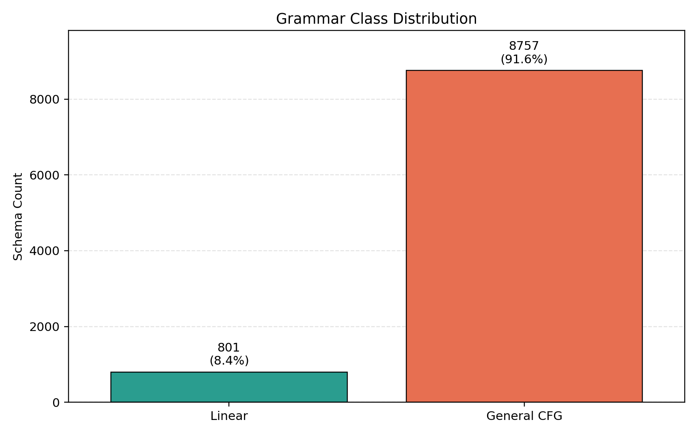
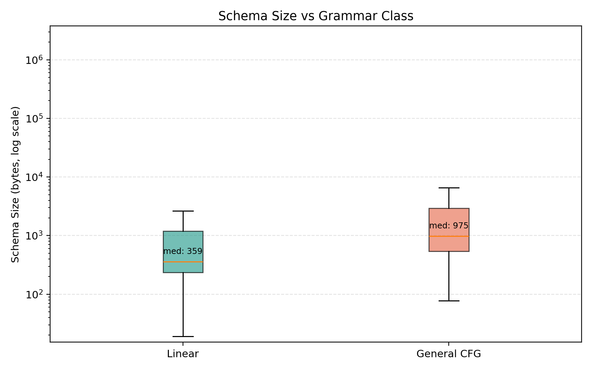

# Empirical Companion for "Grammar-Constrained (CFL) Reachability"

## Subcubic Preprocessing, Indexing Trade-offs, and Structured Decoding Semantics

This repository contains the empirical pipeline used in the manuscript section that analyzes JSON schema structure under CFG-based linear vs general classification.

## Manuscript-aligned scope

The code in this repo covers:

- JSONSchemaBench loading (`epfl-dlab/JSONSchemaBench`)
- JSON Schema to structural CFG conversion
- Linear vs general CFG classification
- Manuscript tables (A-E) printed to console
- Per-schema export to `schema_analysis.csv`
- Figure generation with matplotlib

This repo does not implement the full reachability/indexing algorithms from the theory sections; it is the empirical validation companion for the schema-structure analysis.

## Conversion design used by the manuscript

- Object properties are modeled as chained productions, keeping productions linear-friendly.
- Variable-length arrays are modeled with recursive item-list productions (`ITEMS -> Item | Item ',' ITEMS`), introducing non-linearity.

This modeling choice is the key bridge between schema structure and the linear/general grammar split reported in the paper.

## Repository files

- `schema_cfg_analyzer.py`: end-to-end analysis pipeline
- `plot_schema_analysis.py`: plot generation from CSV output
- `schema_analysis.csv`: per-schema metrics
- `class_distribution.png`: grammar class distribution figure
- `schema_size_vs_is_linear.png`: schema-size-vs-class figure

## Requirements

- Python 3.10+
- pip

Install dependencies:

```bash
python3 -m pip install datasets jsonschema huggingface_hub matplotlib
```

## Reproduce the analysis

Run:

```bash
python3 schema_cfg_analyzer.py
```

If Hugging Face auth is required:

```bash
huggingface-cli login
```

Or:

```bash
HF_TOKEN=your_token_here python3 schema_cfg_analyzer.py
```

## Generated outputs

- Table A: dataset-level linear vs general distribution
- Table B: non-linearity sources (`array`, `nested object`, `$ref`)
- Table C: `|P|` and `|N|` distribution statistics
- Table D: LaTeX-ready summary table
- Table E: schema byte size vs grammar class summary
- `schema_analysis.csv`: one row per schema

## CSV columns

- `dataset`
- `schema_id`
- `num_productions`
- `num_nonterminals`
- `num_terminals`
- `max_rhs_nt`
- `nonlinear_productions`
- `is_linear`
- `has_recursion`
- `has_array`
- `has_nested_object`
- `schema_size`
- `error`

## Generate figures

Run:

```bash
python3 plot_schema_analysis.py
```

This creates:

- `class_distribution.png`
- `schema_size_vs_is_linear.png`

## Figures

### Grammar Class Distribution



### Schema Size vs Grammar Class



## Snapshot from current run

On the run in this workspace (JSONSchemaBench snapshot at execution time):

- Total schemas analyzed: 9,558
- Linear: 801 (8.4%)
- General CFG: 8,757 (91.6%)

These values are dataset-version dependent and may change if upstream data updates.
